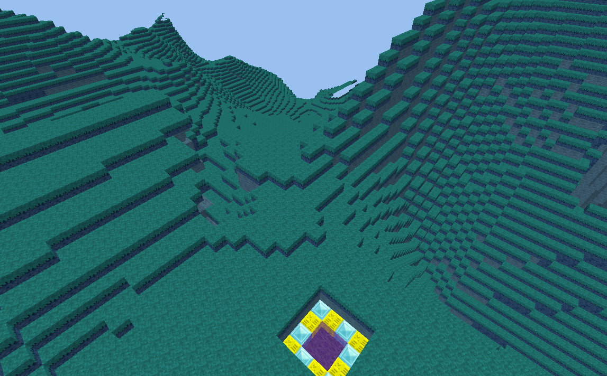

minetest mod floatland
============================

Simple mod to added rare greenbiomes to floadlands event only snown

Information
-----------

This mod is named `floatland_realm`, it produces a large floadlands, 
but the biome is more nice event simple snown when others mods like ethereal 
are present. It provide a command chat to defined an area called `floatland_spawn` 
it redfined the older mod spawm point area of the same name, (but deprecated)

This mod put rare blocks in high lands so a diamond shovel will be need there.

Technical info
--------------

This is a fork for minenux project, from original work of floadlands_realm 
its just to provide nice biomes when other mods like ethereal only produces snown.

it uses the setting from minetest config files of mapgen v7, specially the `mgv7_floatland_level` 
and try to redefined the floatland layer of biome fully.

The spawn point if the merge of the `floatland_spawn` mod code, with some checks, 
original mods were so crude and just overrides all the biome generation.. this mod 
do not redefine the spawn point, for that you can managed after server start and 
world was generated.

#### Status

Currently only some nodes are defined, still pending to define digging of tools.

A simplistic implementation but more customized is at the subnasa sub game of minenux project.

#### Depends

* mgv7 mapgen only
* default mod

#### Blocks

| Node/item        | tecnical names         | related/drop |  note                    |
| ---------------- | ---------------------- | ------------ | ------------------------ |
| Float Sand       | floatland_realm:sand   |              | top block, use diamond shovel |
| Float Grass      | floatland_realm:grass  | default:dirt | top block, use diamond shovel |
| Float Dirt       | floatland_realm:dirt   |              | |
| Float Stone      | floatland_realm:stone  | floatland_realm:dirt | |
| Float Key        | floatland_realm:key    |              | For use in Float land portals |
| Float portal smk | floatland_realm:portal | floatland_realm:key, default:mese | The smoke inside of the portal |

#### Biomes

| Name            | technical names  | nodes of biome |
| --------------- | ---------------- | ---------------------------------------------- |
| Floatland Beach | floatland_beach | floatland_realm:grass, floatland_realm:dirt, floatland_realm:stone |
| Floatland grass | floatland_grass | floatland_realm:sand, floatland_realm:stone |

#### Chat commands

* `portal` will build the floatland like spawn place, at the current player position

# License

CC BY SA 3 mckayshirou

Based in Amaz an archived work of it are at https://github.com/Amaz1/floatland_realm

The noise code is based on the floatlands C++ noise code. 
See https://github.com/minetest/minetest/blob/28841961ba91b943b7478704181604fa3e24e81e/src/mapgen_v7.cpp#L415

